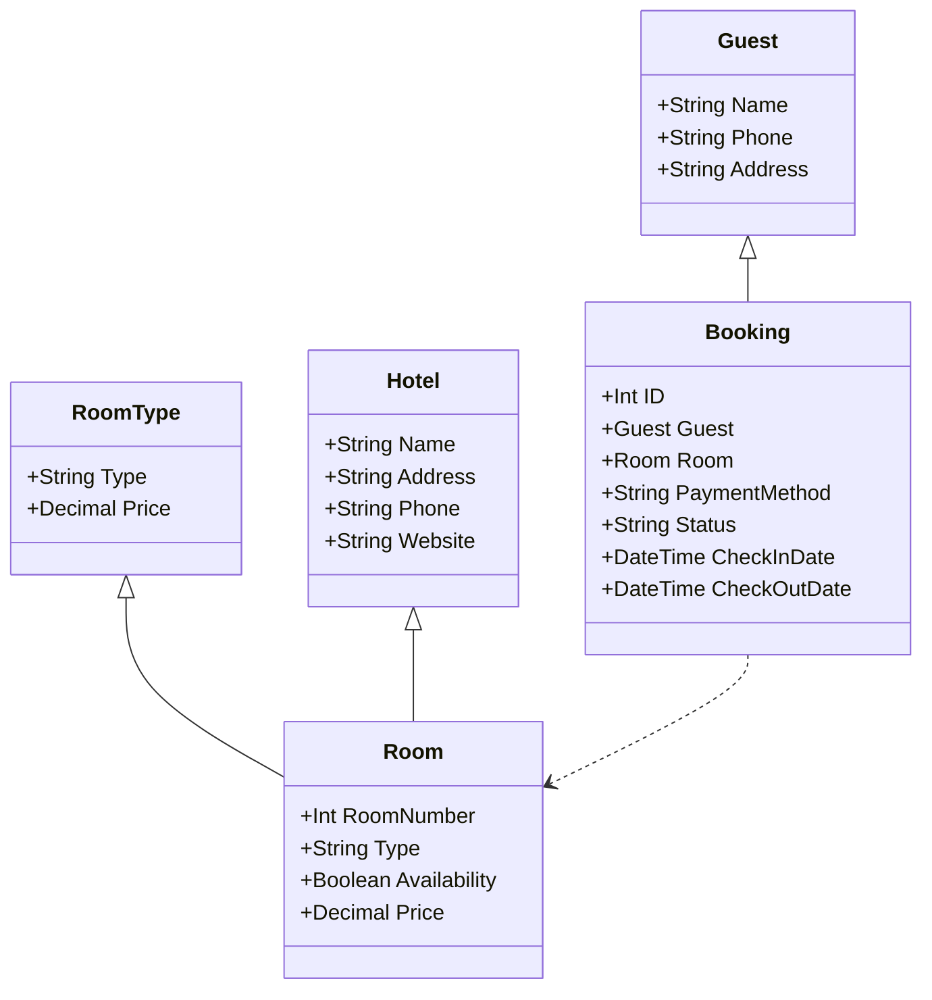
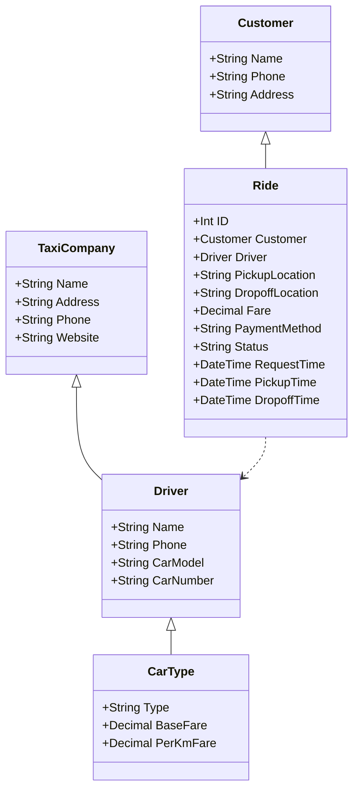

Бронирование намеров в отеле 

```mermaid
classDiagram
class Hotel {
  +String Name
  +String Address
  +String Phone
  +String Website
}

class Room {
  +Int RoomNumber
  +String Type
  +Boolean Availability
  +Decimal Price
}

class Guest {
  +String Name
  +String Phone
  +String Address
}

class Booking {
  +Int ID
  +Guest Guest
  +Room Room
  +String PaymentMethod
  +String Status
  +DateTime CheckInDate
  +DateTime CheckOutDate
}

class RoomType {
  +String Type
  +Decimal Price
}

RoomType <|-- Room
Hotel <|-- Room
Guest <|-- Booking
Booking ..> Room
```

```mermaid
classDiagram
class TaxiCompany {
  +String Name
  +String Address
  +String Phone
  +String Website
}

class Driver {
  +String Name
  +String Phone
  +String CarModel
  +String CarNumber
}

class Customer {
  +String Name
  +String Phone
  +String Address
}

class Ride {
  +Int ID
  +Customer Customer
  +Driver Driver
  +String PickupLocation
  +String DropoffLocation
  +Decimal Fare
  +String PaymentMethod
  +String Status
  +DateTime RequestTime
  +DateTime PickupTime
  +DateTime DropoffTime
}

class CarType {
  +String Type
  +Decimal BaseFare
  +Decimal PerKmFare
}

Driver <|-- CarType
TaxiCompany <|-- Driver
Customer <|-- Ride
Ride ..> Driver
```
