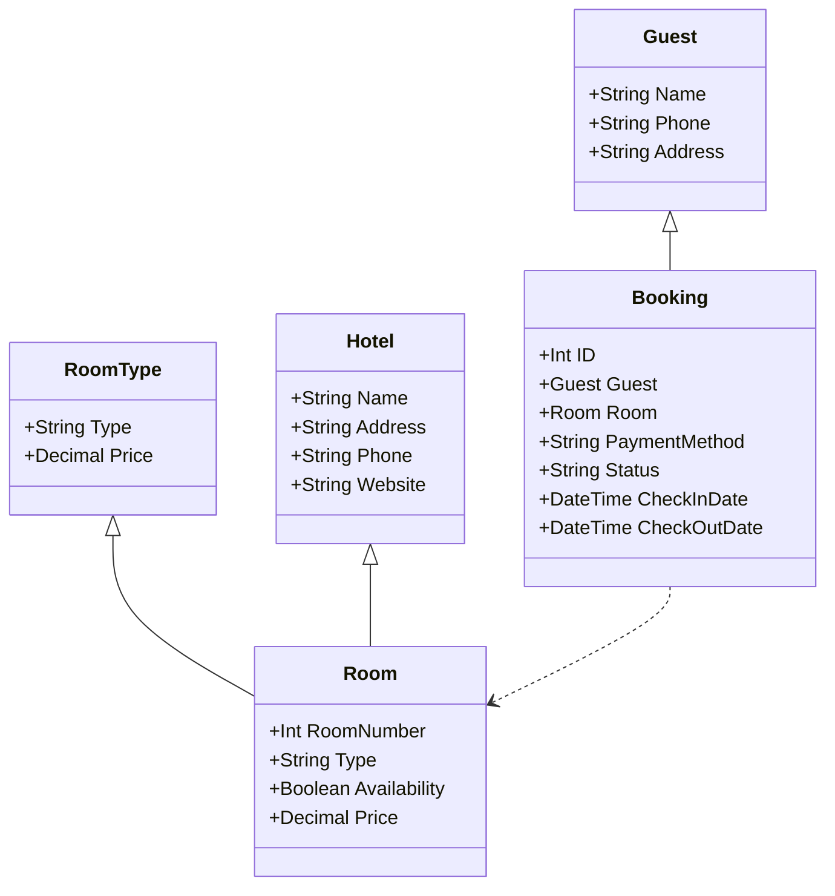

```mermaid
classDiagram
class Hotel {
  +String Name
  +String Address
  +String Phone
  +String Website
}

class Room {
  +Int RoomNumber
  +String Type
  +Boolean Availability
  +Decimal Price
}

class Guest {
  +String Name
  +String Phone
  +String Address
}

class Booking {
  +Int ID
  +Guest Guest
  +Room Room
  +String PaymentMethod
  +String Status
  +DateTime CheckInDate
  +DateTime CheckOutDate
}

class RoomType {
  +String Type
  +Decimal Price
}

RoomType <|-- Room
Hotel <|-- Room
Guest <|-- Booking
Booking ..> Room
```
