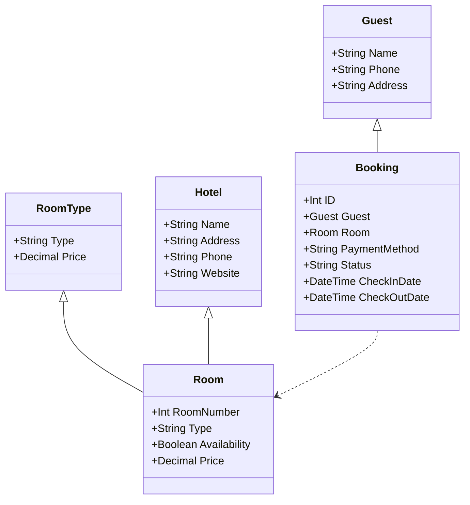
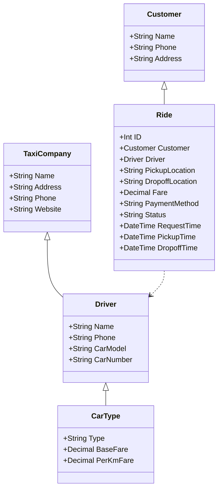
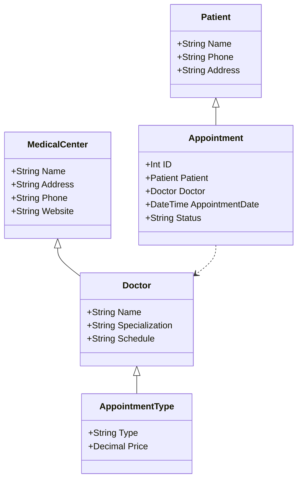
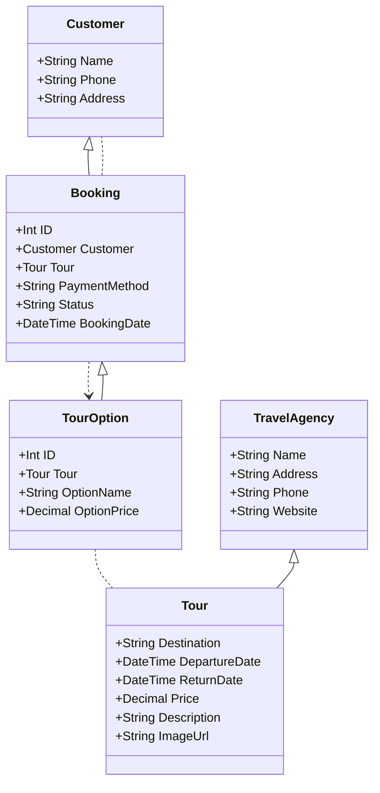
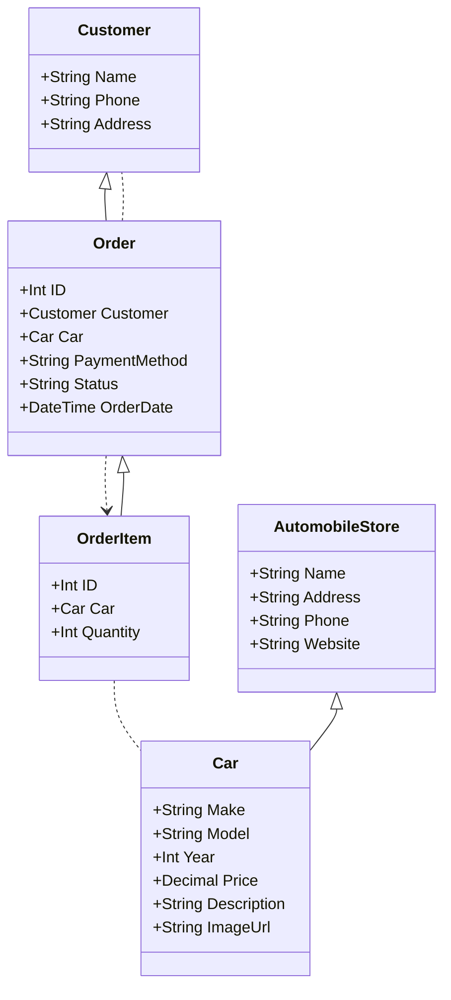

# UML - Запись к врачу через мобильное приложение:

# UML - Заказ такси через мобильое приложение:

# UML - Запись к врачу через мобильное приложение:

# UML - Покупка тура в турагенстве:

# UML - Создание сайта автомагазина

